# Parser & Syntax Layer Refactoring Plan

> **Author**: Architecture Review — February 2026  
> **Scope**: `syster/base/src/parser/`, `syster/base/src/syntax/`, and `syster/base/src/hir/symbols.rs`  
> **Total lines under review**: ~23,200

---

## 1. Current Architecture

### 1.1 Module Dependency Graph (Current)

```mermaid
graph TD
    subgraph ide["ide/"]
        IDE[analysis.rs<br/>semantic_tokens.rs]
    end

    subgraph hir["hir/"]
        HIR[symbols.rs<br/>db.rs<br/>resolve.rs]
    end

    subgraph syntax["syntax/"]
        SF[file.rs<br/><i>SyntaxFile</i>]
        SP[parser.rs<br/><i>ParseError ②</i><br/><i>ParseResult ②</i>]
        NM[normalized.rs<br/><b>2,846 lines</b>]
        FMT[formatter/]
        FMT_LEX[formatter/lexer.rs<br/><b>Duplicate Lexer</b>]
        FMT_SK[formatter/syntax_kind.rs<br/><b>Duplicate SyntaxKind</b>]
        TR[traits.rs<br/><i>Dead code</i>]
    end

    subgraph parser["parser/"]
        PP[parser.rs<br/><i>SyntaxError ①</i><br/><i>kind_to_name 280L</i><br/><i>Trait impls</i>]
        LEX[lexer.rs<br/>827 lines]
        SK[syntax_kind.rs<br/>547 lines]
        AST[ast.rs<br/><b>2,165 lines</b>]
        RES[result.rs<br/><i>ParseError ①</i><br/><i>ParseResult ①</i>]
        RP[rule_parser.rs]
        FIO[file_io.rs]
        KW[keywords.rs]

        subgraph errors["errors/ (dead)"]
            ERR[error.rs<br/><i>SyntaxError ②</i>]
            CODES[codes.rs<br/>338 lines]
            CTX[context.rs<br/>305 lines]
        end

        subgraph grammar["grammar/"]
            GM[mod.rs]
            SYSML[sysml.rs<br/><b>5,737 lines</b>]
            KERML[kerml.rs<br/><b>2,826 lines</b>]
            KEXPR[kerml_expressions.rs<br/>993 lines]
        end
    end

    IDE --> HIR
    IDE --> SF
    HIR --> SF
    HIR --> NM
    HIR --> LEX

    SF --> PP
    SP --> SF
    NM -->|18+ imports| AST
    NM --> PP

    FMT --> FMT_LEX
    FMT --> FMT_SK

    PP --> SYSML
    PP --> KERML
    PP --> KEXPR
    PP --> LEX
    PP --> SK

    SYSML --> KEXPR
    KERML --> KEXPR

    style SYSML fill:#ff6b6b,color:#fff
    style NM fill:#ff6b6b,color:#fff
    style AST fill:#ffa94d,color:#fff
    style KERML fill:#ffa94d,color:#fff
    style FMT_LEX fill:#e03131,color:#fff
    style FMT_SK fill:#e03131,color:#fff
    style ERR fill:#868e96,color:#fff
    style CODES fill:#868e96,color:#fff
    style CTX fill:#868e96,color:#fff
    style TR fill:#868e96,color:#fff
    style RES fill:#868e96,color:#fff
```



**Legend**:  
🔴 Red = God files (>2,500 lines) or duplicated code  
🟠 Orange = Large files needing splits (>2,000 lines)  
⚫ Grey = Dead/unused code  

### 1.2 Current File Structure

```
parser/                              # ~11,500 lines
├── mod.rs                    (50)   # Re-exports
├── parser.rs                (996)   # Core parser + 280L kind_to_name + trait impls
├── lexer.rs                 (827)   # Logos tokenizer
├── syntax_kind.rs           (547)   # SyntaxKind enum (canonical)
├── ast.rs                 (2,165)   # ⚠ GOD FILE — all AST node types
├── result.rs                 (74)   # ⚠ DUPLICATE ParseError/ParseResult
├── rule_parser.rs           (499)   # Rule-based test parser
├── file_io.rs                (45)   # File loading
├── keywords.rs              (249)   # Keyword lists
├── errors/                          # ⚠ ~1,000 lines DEAD CODE
│   ├── mod.rs                (18)
│   ├── error.rs             (357)   #   Rich SyntaxError (unused)
│   ├── codes.rs             (338)   #   ErrorCode enum (unused)
│   ├── context.rs           (305)   #   ParseContext enum (unused)
│   └── tests.rs             (186)   #   Tests for dead code
└── grammar/
    ├── mod.rs                (17)   # Re-exports
    ├── sysml.rs           (5,737)   # ⚠ GOD FILE — all SysML grammar
    ├── kerml.rs           (2,826)   # KerML grammar
    └── kerml_expressions.rs (993)   # Expression precedence chain

syntax/                              # ~4,500 lines
├── mod.rs                    (24)   # Re-exports
├── file.rs                  (143)   # SyntaxFile wrapper
├── parser.rs                (186)   # ⚠ DUPLICATE ParseError/ParseResult
├── normalized.rs          (2,846)   # ⚠ GOD FILE — CST→Normalized conversion
├── traits.rs                 (17)   # ⚠ DEAD — AstNode/Named/ToSource (unused)
├── formatter/
│   ├── mod.rs               (518)   # Formatter logic
│   ├── lexer.rs             (560)   # ⚠ DUPLICATE of parser/lexer.rs
│   ├── syntax_kind.rs       (219)   # ⚠ DUPLICATE of parser/syntax_kind.rs
│   ├── options.rs            (33)   # Format options
│   └── tests/                       # Formatter tests
└── tests/
    ├── mod.rs
    └── tests_span.rs
```

### 1.3 Problems Summary

| # | Problem | Severity | Lines Affected |
|---|---------|----------|----------------|
| P1 | **`SyntaxError` defined twice** — simple in `parser.rs:34`, rich in `errors/error.rs:74`. Rich version has zero callers. | High | ~400 |
| P2 | **`ParseError`/`ParseResult` defined twice** — `parser/result.rs` and `syntax/parser.rs`, identical shape, different types. | High | ~150 |
| P3 | **Formatter has its own lexer + SyntaxKind** — completely separate tokenizer with different naming conventions. | Critical | ~780 |
| P4 | **`sysml.rs` is 5,737 lines** — actions, states, requirements, definitions, connections all in one file. | Critical | 5,737 |
| P5 | **`normalized.rs` is 2,846 lines** — repetitive `from_rowan()` conversions and match arms. | High | 2,846 |
| P6 | **`ast.rs` is 2,165 lines** — every AST node type in a single file. | High | 2,165 |
| P7 | **`KerMLParser` and `SysMLParser` traits duplicate 5 method signatures** and `parse_identification` is copy-pasted between them. | Medium | ~200 |
| P8 | **`errors/` module is ~1,000 lines of dead code** — ErrorCode, ParseContext, rich SyntaxError all exported but never consumed. | Medium | ~1,000 |
| P9 | **`kind_to_name` is a 280-line match in `parser.rs`** — belongs on SyntaxKind as an inherent method. | Low | 280 |
| P10 | **`syntax::traits.rs` is dead** — defines AstNode/Named/ToSource with no implementations. Real AstNode is in `parser/ast.rs`. | Low | 17 |
| P11 | **Keyword constants duplicated** between `kerml.rs` and `sysml.rs` (`STANDALONE_RELATIONSHIP_KEYWORDS`, `RELATIONSHIP_OPERATORS`). | Low | ~50 |
| P12 | **`normalized.rs` is a redundant mapping layer** — 2,846 lines converting AST types the HIR could consume directly. Only 2 files use it (`hir/symbols.rs` + 8 lines in `interchange/integrate.rs`). Creates a triple-mapping chain: AST enums → Normalized enums → HirSymbol enums. Every new node kind requires updating 3 files. | High | ~3,850 (2,846 normalized + ~1,000 double-mapping in symbols.rs) |

---

## 2. Target Architecture

### 2.1 Module Dependency Graph (Target)


**Legend**:  
🟢 Green = New/refactored modules (focused, <500 lines each)  
🔵 Blue = Unified single-source-of-truth modules  
🟣 Purple = Refactored to consume AST directly (normalized layer eliminated)  

### 2.2 Target File Structure

```
parser/                              # ~12,400 lines
├── mod.rs                    (50)   # Re-exports
├── parser.rs                (500)   # Core parser + trait impls (kind_to_name moved out)
├── lexer.rs                 (827)   # Logos tokenizer ← SINGLE SOURCE OF TRUTH
├── syntax_kind.rs           (830)   # SyntaxKind enum + display_name() method
├── rule_parser.rs           (499)   # Rule-based test parser
├── file_io.rs                (45)   # File loading
├── keywords.rs              (249)   # Keyword lists
├── ast/                             # ← SPLIT from ast.rs (2,165 lines)
│   ├── mod.rs               (350)   #   AstNode trait, macros, SourceFile, NamespaceMember
│   ├── package.rs           (250)   #   Package, LibraryPackage, NamespaceBody, Import, Alias
│   ├── definition.rs        (500)   #   Definition, DefinitionKind, Specialization, ValueExpression
│   ├── usage.rs             (450)   #   Usage, UsageKind, Direction, Multiplicity
│   ├── expression.rs        (300)   #   Expression, QualifiedName, Literals
│   ├── actions.rs           (250)   #   SendAction, AcceptAction, ControlNode, loops
│   └── connectors.rs        (200)   #   Connector, ConnectUsage, BindingConnector, Succession
└── grammar/
    ├── mod.rs               (120)   # BaseParser trait + shared constants ← UNIFIED
    ├── kerml.rs           (2,600)   # KerML grammar (trimmed, deduped)
    ├── kerml_expressions.rs (993)   # Expression precedence chain
    └── sysml/                       # ← SPLIT from sysml.rs (5,737 lines)
        ├── mod.rs           (400)   #   SysMLParser trait, entry points, helpers
        ├── actions.rs     (1,200)   #   accept, send, perform, if/while/for, control nodes
        ├── states.rs        (800)   #   entry, exit, do, transitions
        ├── requirements.rs  (600)   #   subject, actor, stakeholder, objective
        ├── definitions.rs (1,500)   #   parse_definition_or_usage, variant
        └── connections.rs   (500)   #   connect, binding, succession, flow

syntax/                              # ~900 lines (normalized layer eliminated)
├── mod.rs                    (24)   # Re-exports
├── file.rs                  (143)   # SyntaxFile wrapper
├── parser.rs                (186)   # ParseError, ParseResult ← SINGLE SOURCE OF TRUTH
├── formatter/
│   ├── mod.rs               (518)   # Formatter logic ← USES PARSER'S LEXER NOW
│   ├── options.rs            (33)   # Format options
│   └── tests/
└── tests/
    ├── mod.rs
    └── tests_span.rs

hir/symbols.rs             (~1,800)  # ← SIMPLIFIED: consumes AST directly, no double-mapping

DELETED:
  parser/result.rs             (74)   # ✗ Duplicate of syntax/parser.rs
  parser/errors/error.rs      (357)   # ✗ Rich SyntaxError — zero callers
  parser/errors/codes.rs      (338)   # ✗ ErrorCode — zero callers  
  parser/errors/context.rs    (305)   # ✗ ParseContext — zero callers
  parser/errors/tests.rs      (186)   # ✗ Tests for dead code
  parser/errors/mod.rs         (18)   # ✗ Module file for dead code
  syntax/traits.rs             (17)   # ✗ Dead AstNode/Named/ToSource
  syntax/formatter/lexer.rs   (560)   # ✗ Duplicate lexer
  syntax/formatter/syntax_kind.rs (219) # ✗ Duplicate SyntaxKind
  syntax/normalized.rs      (2,846)   # ✗ Redundant mapping layer — HIR uses AST directly
                              -----
                             4,920 lines deleted
```

### 2.3 Why the Normalized Layer Is Eliminated

The `normalized.rs` module (2,846 lines) is a mapping layer that converts rowan AST nodes
into owned structs (`NormalizedDefinition`, `NormalizedUsage`, etc.) with plain `String`
names and simplified kind enums. It has **exactly 2 consumers**:

| Consumer | Types Used | Lines Referencing Normalized |
|----------|-----------|-----------------------------|
| `hir/symbols.rs` | All 13+ types | 294 lines |
| `interchange/integrate.rs` | `ValueExpression` only | 8 lines |

The data currently flows through a **triple-mapping chain**:

```
Rowan AST (.name(), .definition_kind(), .is_abstract(), etc.)
    ↓ from_rowan() — 2,846 lines of enum-to-enum mapping
Normalized (NormalizedDefKind::Part, etc.)
    ↓ extract_from_normalized_* — double-mapping in symbols.rs
HirSymbol (SymbolKind::PartDefinition, etc.)
```

Every accessor the normalized layer uses already exists on the AST:
- `NormalizedDefinition.name` = `def.name().and_then(|n| n.text())`
- `NormalizedDefKind::Part` = `RowanDefinitionKind::Part` (1:1)
- `NormalizedUsage.is_abstract` = `usage.is_abstract()`
- `NormalizedRelationship` = `def.specializations()` iteration

By having `hir/symbols.rs` consume the AST directly, we eliminate:
- 2,846 lines of normalized conversion code
- ~1,000 lines of double-mapping in symbols.rs (9 `extract_from_normalized_*` functions)
- The requirement to update 3 files for every new node kind
- Unnecessary intermediate `String` allocations (AST → owned String → `Arc<str>`)

`ValueExpression` moves to `parser/ast/definition.rs` — it's a useful enum, just currently
in the wrong module.

**Rowan stays invisible to HIR**: The typed AST wrappers (`Definition`, `Usage`, etc.) are
already opaque newtypes over `SyntaxNode`. Their public API exposes only domain-typed
accessors (`.name()`, `.is_abstract()`, `.definition_kind()`). The `SyntaxNode` and
`SyntaxToken` type aliases, while technically public, have generic names that don't mention
rowan. After this refactoring, HIR imports only the typed wrappers — rowan is a private
implementation detail of the parser layer, not an architectural dependency of the HIR.

---

## 3. To-Do List

### Phase 1 — Kill Duplication ✅ COMPLETE

- [x] **1.1** Delete `parser/errors/` module entirely (`error.rs`, `codes.rs`, `context.rs`, `tests.rs`, `mod.rs`) — ~1,200 lines of dead code. Remove re-exports from `parser/mod.rs`.
- [x] **1.2** Delete `syntax/traits.rs` — dead `AstNode`/`Named`/`ToSource` traits with zero implementations. Remove re-export from `syntax/mod.rs`.
- [x] **1.3** Delete `parser/result.rs` — duplicate `ParseError`/`ParseResult`. Redirect any imports to `syntax/parser.rs`.
- [x] **1.4** Move `kind_to_name()` from `parser/parser.rs` to `SyntaxKind::display_name(&self)` in `parser/syntax_kind.rs`. Update all call sites to use `kind.display_name()`.
- [x] **1.5** Unify formatter SyntaxKind: delete `syntax/formatter/syntax_kind.rs` (~220 lines). Formatter now uses canonical `parser::SyntaxKind`/`SyntaxNode`. Formatter keeps its own Logos lexer (needed for multi-word keywords like `"use case"`) but maps to parser's `SyntaxKind` variants. Fixed `strucut` typo and lossy punct mappings.
- [x] **1.6** Deduplicate `STANDALONE_RELATIONSHIP_KEYWORDS` and `RELATIONSHIP_OPERATORS` — moved shared constants from `kerml.rs` and `sysml.rs` into `grammar/mod.rs`.
- [x] **1.7** Deduplicate `parse_identification` — SysMLParser impl now delegates to `kerml::parse_identification`.

> **Phase 1 deviation note:** Task 1.5 was scoped differently than planned. The
> formatter's Logos lexer could not be fully replaced with the parser's `Lexer`
> because the formatter lexes multi-word keywords (`"use case"`, `"typed by"`) as
> single tokens, while the parser treats them as separate tokens. Instead, we
> deleted the formatter's duplicate `SyntaxKind` enum + `SysMLLanguage` + rowan
> type aliases (~220 lines) and wired the formatter's lexer to produce the
> parser's `SyntaxKind` values. Net savings: ~215 lines (not ~800 as estimated).

### Phase 2 — Split God Files ✅ COMPLETE

> **Completed**: February 2026 — 3 commits  
> **Lines reorganized**: ~10,688 lines across 3 files → 20 submodule files

- [x] **2.1** Split `grammar/sysml.rs` (5,678 lines) into `grammar/sysml/` directory (10 files):
  - [x] `sysml/mod.rs` — SysMLParser trait, constants, keyword predicates (~275 lines)
  - [x] `sysml/helpers.rs` — shared helper functions: bump_keyword, expect_and_skip, etc. (~315 lines)
  - [x] `sysml/body.rs` — parse_body (~55 lines)
  - [x] `sysml/namespace.rs` — package/import/alias parsing (~190 lines)
  - [x] `sysml/entry.rs` — file entry point + parse_package_body_element (~445 lines)
  - [x] `sysml/actions.rs` — action body elements (~770 lines)
  - [x] `sysml/states.rs` — state body elements (~235 lines)
  - [x] `sysml/requirements.rs` — requirement body elements (~440 lines)
  - [x] `sysml/definitions.rs` — definition/usage parsing (~2,435 lines)
  - [x] `sysml/relationships.rs` — specialization/annotation/relationship (~565 lines)
- [x] **2.2** Split `ast.rs` (2,165 lines) into `ast/` directory (6 files):
  - [x] `ast/mod.rs` — AstNode/AstToken traits, macros, utilities (~540 lines)
  - [x] `ast/namespace.rs` — SourceFile, NamespaceMember, Package, Import, Alias, Dependency (~310 lines)
  - [x] `ast/elements.rs` — Filter, Comment, Metadata, Definition, Usage, Names (~590 lines)
  - [x] `ast/relationships.rs` — Typing, Specialization, transitions, action/state nodes, connectors (~450 lines)
  - [x] `ast/expressions.rs` — Expression, FeatureChainRef, ConstraintBody (~160 lines)
  - [x] `ast/tests.rs` — AST unit tests (~110 lines)
- [x] **2.3** Split `normalized.rs` (2,845 lines) into `normalized/` directory (4 files):
  - [x] `normalized/mod.rs` — type definitions, NormalizedElement enum, helper functions, iteration (~780 lines)
  - [x] `normalized/definition.rs` — NormalizedPackage + NormalizedDefinition impls (~180 lines)
  - [x] `normalized/usage.rs` — NormalizedUsage impl (~1,780 lines)
  - [x] `normalized/imports.rs` — NormalizedImport, NormalizedAlias, NormalizedDependency impls (~106 lines)

> **Deviation from plan**: The actual file groupings differ from the original plan's proposed filenames.
> Key decisions:
> - sysml.rs: Split into 10 files (plan had 6) for finer granularity. `helpers.rs` extracted as shared utility module. `entry.rs` holds the main dispatch. `relationships.rs` instead of `connections.rs`.
> - ast.rs: Split into 6 files (plan had 7). Grouped by concern rather than strict type-per-file. Used `pub(crate)` on ast_node! macro field for cross-module construction.
> - normalized.rs: Split into 4 files (plan had 6). Kept type definitions + NormalizedElement dispatch in mod.rs rather than separate files. Helper functions stayed in mod.rs as `pub(super)`.
> - Cross-module pattern: `pub(super)` visibility + `use super::*;` for sibling access throughout.

### Phase 2b — Refine definitions.rs Split

> **Status**: In progress  
> **Context**: Phase 2 split `sysml.rs` into 10 files, but `definitions.rs` at 2,435 lines is still a god file containing definition parsing, usage parsing, connector parsing, and specialized body parsers all lumped together.

- [x] **2b.1** Split `sysml/definitions.rs` (2,435 lines) into 5 focused files:
  - [x] `sysml/classify.rs` — `parse_definition_or_usage` entry point, classification dispatch (~171 lines)
  - [x] `sysml/usage.rs` — `parse_usage`, keyword/prefix helpers (~584 lines)
  - [x] `sysml/connectors.rs` — bind, connect, connector, succession, flow parsers (~602 lines)
  - [x] `sysml/bodies.rs` — case_body, metadata_body, calc_body, member parsers (~515 lines)
  - [x] `sysml/definitions.rs` — constraint_body, dependency, filter, variant, redefines (~523 lines)
  - Also removed dead freestanding `parse_multiplicity`/`parse_multiplicity_bound` (duplicated trait method)

- [x] **2b.2** Remove KerML definition handling from SysML grammar — `1b350a5`:
  - Removed `DefinitionClassification::KermlDefinition`, `parse_kerml_definition`, `is_kerml_definition_keyword` from `classify.rs`
  - Removed KerML keyword entries (`CLASS_KW`, `STRUCT_KW`, `DATATYPE_KW`, etc.) from `entry.rs`
  - Merged remaining `classify.rs` content (`parse_definition_or_usage`, `has_def_keyword`, `parse_definition`) into `definitions.rs`, deleted `classify.rs`
  - Fixed tests: converted KerML syntax in SysML test sources to valid SysML

- [x] **2b.3** Deduplicate sysml/ grammar files (~235 lines removed) — `47dfc6d`:
  - **A. Kill duplicate member parsers in bodies.rs** (~162 lines): `parse_subject_member`, `parse_actor_member`, `parse_stakeholder_member`, `parse_objective_member` are hand-rolled duplicates of the public versions in requirements.rs (`parse_subject_usage`, `parse_actor_usage`, etc.). Have `parse_case_body` call the requirements.rs versions instead.
  - **B. Replace inline default-value parsing** (~50 lines): 3 spots in bodies.rs and 2 in definitions.rs hand-roll the same `DEFAULT_KW`/`EQ`/`COLON_EQ` pattern that `parse_optional_default_value` in helpers.rs already handles.
  - **C. Replace inline typing patterns** (~16 lines): 5 spots in bodies.rs and 3 in definitions.rs do `if p.at(COLON) { p.parse_typing(); p.skip_trivia(); }` instead of using `parse_optional_typing(p)`.
  - **D. Normalize specialization calls**: Replace manual `parse_specializations(p); p.skip_trivia();` pairs with `parse_specializations_with_skip(p)` for consistency.

### Phase 3 — Unify Parser Traits

- [ ] **3.1** Extract common trait `BaseParser` with the 7 shared methods from `KerMLParser` and `SysMLParser` into `grammar/mod.rs`.
- [ ] **3.2** Make `KerMLParser: BaseParser` and `SysMLParser: BaseParser` — remove duplicated method signatures.
- [ ] **3.3** Implement `BaseParser` for `Parser` once in `parser.rs`, removing the duplicated implementations.

### Phase 4 — Clarify Module Boundaries

- [ ] **4.1** Ensure `syntax/parser.rs` is the single canonical location for `ParseError` and `ParseResult`. All crate-internal consumers import from `crate::syntax::parser`.
- [ ] **4.2** Audit and remove any remaining `backwards compatibility` re-exports in `lib.rs` that reference deleted modules.
- [ ] **4.3** Update `lib.rs` module doc comment to reflect new structure.

### Phase 5 — Eliminate Normalized Layer

> **Prerequisite**: Phases 1-4 completed (AST is split into focused files, traits are unified).
> This phase removes the `syntax/normalized.rs` module (2,846 lines) and rewrites
> `hir/symbols.rs` to extract symbols directly from the typed AST wrappers.
>
> **API boundary rule**: `hir/symbols.rs` must **only** import named AST wrapper types
> (`Definition`, `Usage`, `Package`, `Import`, etc.) and their kind enums
> (`DefinitionKind`, `UsageKind`, `Direction`). It must **never** import `SyntaxNode`,
> `SyntaxToken`, or `rowan::*` directly. If a span or text range is needed, use
> `.syntax().text_range()` via the `AstNode` trait — or better, add a
> `.text_range()` convenience method on the AST types themselves. This keeps rowan
> as a private implementation detail of the parser layer.

- [ ] **5.1** Move `ValueExpression` enum from `syntax/normalized.rs` to `parser/ast/definition.rs`. Update the 8 lines in `interchange/integrate.rs` to import from the new location.
- [ ] **5.2** Rewrite `extract_from_normalized_package` → `extract_from_package` consuming `parser::Package` directly.
- [ ] **5.3** Rewrite `extract_from_normalized_definition` → `extract_from_definition` consuming `parser::Definition` directly. Inline the kind mapping (`DefinitionKind → SymbolKind`) and relationship extraction.
- [ ] **5.4** Rewrite `extract_from_normalized_usage` → `extract_from_usage` consuming `parser::Usage` directly. This is the largest function — migrate field-by-field, matching each `NormalizedUsage` field to its AST accessor.
- [ ] **5.5** Rewrite `extract_from_normalized_import` → `extract_from_import` consuming `parser::Import` directly.
- [ ] **5.6** Rewrite `extract_from_normalized_alias` → `extract_from_alias` consuming `parser::Alias` directly.
- [ ] **5.7** Rewrite `extract_from_normalized_comment` → `extract_from_comment` consuming `parser::Comment` directly.
- [ ] **5.8** Rewrite `extract_from_normalized_dependency` → `extract_from_dependency` consuming `parser::Dependency` directly.
- [ ] **5.9** Rewrite top-level `extract_from_normalized` dispatch to match on `NamespaceMember` variants directly (the enum already has 22 variants — use the same match structure with direct extraction).
- [ ] **5.10** Delete `syntax/normalized.rs` and remove all `NormalizedElement`, `NormalizedDefKind`, etc. re-exports from `syntax/mod.rs`.
- [ ] **5.11** Move `implicit_supertype_for_def_kind` and `implicit_supertype_for_usage_kind` to take AST kind enums (`DefinitionKind`, `UsageKind`) instead of normalized kinds.
- [ ] **5.12** Enforce API boundary: audit `hir/symbols.rs` imports — only `parser::{Definition, Usage, Package, Import, Alias, ...}` and kind enums. No `SyntaxNode` or `rowan::*` imports. Add `#[doc(hidden)]` or `pub(crate)` on `SyntaxNode` re-export if needed to prevent future leakage.
- [ ] **5.13** Run full test suite. The extraction must produce identical `HirSymbol` output for all test fixtures.

---

## 4. Current vs Target Comparison

### 4.1 Structural Comparison


### 4.2 Metrics Comparison

| Metric | Current | Target | Delta |
|--------|---------|--------|-------|
| **Total lines (parser+syntax+symbols)** | ~23,200 | ~15,100 | **-8,100** (~35% reduction) |
| **Lines deleted** | — | — | **~4,920** (dead/dup/normalized) |
| **Lines simplified** | — | — | **~600** (double-mapping in symbols.rs) |
| **Largest file** | `sysml.rs` — 5,737 | `sysml/definitions.rs` — ~1,500 | **-74%** |
| **Files with >1,000 lines** | 5 | 1 (kerml.rs ~2,600) | **-80%** |
| **Duplicated types** | 3 clusters (SyntaxError, ParseError, Lexer+SyntaxKind) | 0 | **-100%** |
| **Redundant mapping layers** | 1 (normalized.rs — 2,846 lines) | 0 | **-100%** |
| **Dead code lines** | ~2,074 | 0 | **-100%** |
| **Number of source files** | 24 | 29 | +5 (smaller, focused) |
| **Avg lines per file** | ~967 | ~521 | **-46%** |
| **Max cognitive load (single file)** | 5,737 lines | ~1,500 lines | **-74%** |
| **Duplicated trait methods** | 7 methods × 2 traits | 0 (BaseParser) | **-100%** |
| **Files to touch for new node kind** | 3 (ast + normalized + symbols) | 2 (ast + symbols) | **-33%** |

### 4.3 Before/After — File Size Distribution


**After refactoring** — no file exceeds ~1,800 lines; normalized layer eliminated; the 14 files above collapse into ~29 files:


### 4.4 Dependency Cleanliness

| Concern | Current | Target |
|---------|---------|--------|
| Formatter tokenizing | Own lexer + own SyntaxKind (divergence risk) | Uses parser's lexer (single truth) |
| Error types | 2× SyntaxError, 2× ParseError, 2× ParseResult | 1 of each, canonical locations |
| Parser trait hierarchy | `ExpressionParser` ← `KerMLParser` / `SysMLParser` (parallel, duped) | `ExpressionParser` ← `BaseParser` ← `KerMLParser` / `SysMLParser` (layered) |
| HIR symbol extraction | AST → Normalized (2,846L) → HirSymbol (triple-mapping) | AST → HirSymbol directly (one hop) |
| Grammar organization | 5,737 lines in one file, control-F to navigate | 6 domain-focused files, navigate by concept |

### 4.5 What Stays the Same

The refactoring is **purely internal restructuring**. These things do **not** change:

- Core public API surface (`parse_sysml`, `parse_kerml`, `SyntaxFile`, `HirSymbol`, etc.)
- CST/AST node kinds (`SyntaxKind` enum values and discriminants)
- Token semantics (lexer behavior is identical — we delete a duplicate, not change behavior)
- Test suite (all existing tests continue to pass; symbol extraction output is identical)
- Module dependency direction (`base → parser → syntax → hir → ide`)
- Rowan-based architecture (GreenNode, SyntaxNode, lossless CST)

**What does change in public API**: `NormalizedElement` and all `Normalized*` types are removed.
They were internal implementation details consumed only by `hir/symbols.rs`. Any external consumer
that was reaching into `syntax::normalized` (none found) would need to use the typed AST
wrappers directly — which are strictly more capable.

**HIR↔Parser boundary**: After Phase 5, the HIR layer imports only typed AST wrapper types
(`Definition`, `Usage`, `Package`, etc.) and their kind enums. It never references `SyntaxNode`,
`SyntaxToken`, or rowan directly. The AST types already abstract rowan behind domain-specific
accessors — this is enforced, not just convention.

---

## 5. Execution Order & Risk Matrix


| Step | Effort | Risk | Lines Deleted | Lines Moved/Simplified |
|------|--------|------|---------------|------------------------|
| 1.1 Delete `errors/` | S | None | ~1,200 | 0 |
| 1.2 Delete `traits.rs` | XS | None | ~17 | 0 |
| 1.3 Delete `result.rs` | S | Low | ~74 | 0 |
| 1.4 Move `kind_to_name` | S | Low | 0 | ~280 moved |
| 1.5 Unify formatter lexer | M | Medium | ~780 | 0 |
| 1.6 Dedup shared constants | S | Low | ~50 | ~50 moved |
| 1.7 Dedup `parse_identification` | S | Low | ~40 | 0 |
| 2.1 Split `sysml.rs` | L | Low | 0 | ~5,700 reorganized |
| 2.2 Split `ast.rs` | M | Low | 0 | ~2,100 reorganized |
| 3.1–3.3 BaseParser trait | M | Medium | ~100 | ~200 moved |
| 4.1–4.3 Boundary cleanup | S | Low | varies | varies |
| 5.1 Move `ValueExpression` | S | Low | 0 | ~100 moved |
| 5.2–5.8 Rewrite extraction fns | L | **High** | 0 | ~1,600 rewritten |
| 5.9 Rewrite dispatch | M | Medium | 0 | ~100 rewritten |
| 5.10 Delete `normalized.rs` | S | Low | ~2,846 | 0 |
| 5.11–5.12 Cleanup & verify | M | Medium | ~200 | varies |

**Total effort**: ~5-6 weeks at moderate pace  
**Total dead/redundant code removed**: ~5,300 lines  
**Total code simplified**: ~600 lines (double-mapping collapsed)  
**Net result**: ~35% fewer lines across parser+syntax+symbols, zero duplication, zero redundant mapping layers, one-hop AST→HirSymbol extraction, clear module boundaries.
